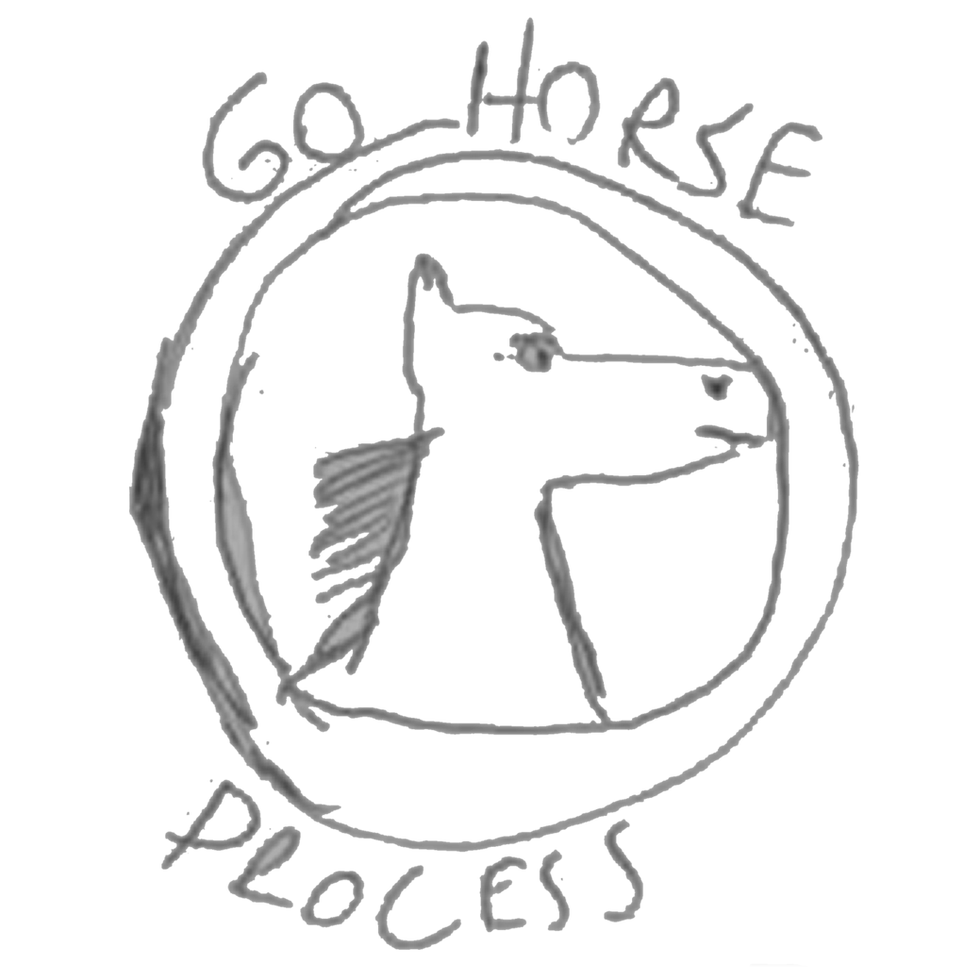

Este projeto foi criado como um desafio para novos desenvolvedores da Mega News.
O objetivo é desenvolver um catálogo de produtos que se comunica com uma API externa, armazena os dados em um banco de dados e exibe os produtos em uma interface gráfica.

Tecnologias Utilizadas:

* Linguagem: Java 22 (Java puro)
* Framework de Interface: JavaFX
* Banco de Dados: PostgreSQL
* API: REST

Funcionalidades:

* Consumo de API: A aplicação realiza requisições à API para obter os dados dos produtos.
* Armazenamento em Banco de Dados: Os dados dos produtos são persistidos em um banco de dados local.
* Exibição da Listagem: A interface JavaFX apresenta a listagem dos produtos de forma clara e organizada.

Pré-requisitos

* Java Development Kit (JDK) 22: Certifique-se de ter o JDK 22 instalado em seu ambiente de desenvolvimento.
* Banco de Dados: Instale e configure o banco de dados escolhido.
* IDE (Opcional): Utilize sua IDE preferida (ex: Eclipse, IntelliJ IDEA) para facilitar o desenvolvimento.

